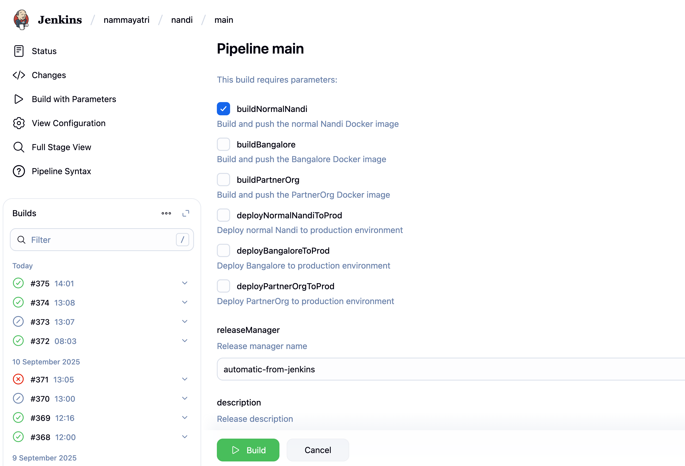

# OSM Fix Workflow for OTP / Nandi

This document explains how to correct OpenStreetMap (OSM) data so that OpenTripPlanner (OTP) routes work properly in **Nandi**.  
Follow these steps carefully whenever a station or path needs correction.

---

## 1. Edit in OpenStreetMap

1. Go to [OpenStreetMap Editor](https://www.openstreetmap.org/edit).  
2. Log in with your OSM account.  
3. Use the **Search** bar:  
   - Enter the station name.  
   - Select **Search worldwide** to find it.  


<br>

---

## 2. Add / Correct Station Details

1. Select the **Line tool**.  


<br>
2. Draw **sidewalks** near the track and **connect them to outside roads**.  
<br>
3. Mark them as `footway` (type = *foot*).  
<br>

<br>
4. Ensure all **crossings** are connected to each other and to the road.  
<br>

<br>

<br>
<br>
⚠️ Connection to the road is important make sure the side platform footways are connected to the road

5. When done, click **Save**.  
<br>


---

## 3. Export Changes

1. Click **Download .osc change file**.  


2. Save the `.osc` file.
3. If you are not a developer send the downloaded file to a developer to integrate and test your changes locally
4. Copy it into the nandi repo at:  

```

assets/

````

---

## 4. Apply Changes Locally

Run the following command (replace filenames as needed):

```bash
osmium apply-changes bangalore.osm.pbf changes.osc -o bangalore.updated.osm.pbf
````

```bash
osmium apply-changes <osm-file-name>.osm.pbf changes.osc -o <osm-file-name>.updated.osm.pbf
```

### Example:

```bash
osmium apply-changes bangalore.osm.pbf station_fix.osc -o bangalore.updated.osm.pbf
```

---

## 5. Update Files in Repo

1. Delete the old OSM `.pbf` file.
2. Rename the updated file back to the original name.

---

## 6. Commit & Push

```bash
git add .
git commit -m "fix: <station_name> OSM correction"
git fetch origin
git rebase origin/main
git push origin HEAD
```

---

## 7. Deploy & Verify

1. Trigger a Jenkins deploy.
2. Verify changes on:

   [Sandbox API](https://api.sandbox.moving.tech/nandi/)



---

## Notes

* Always double-check connectivity (sidewalks and crossings).
* Keep commits focused (one station fix per commit).
* If in doubt, document the change in commit message.

## 🎥 Demo Video

A short recording of the osm workflow is available here:  

👉 [Watch the OSM Fix Workflow Demo (Google Drive)](https://drive.google.com/file/d/17_zozcRZQQq3xgY4mhmcB-16J-cdBohO/view?usp=sharing)
